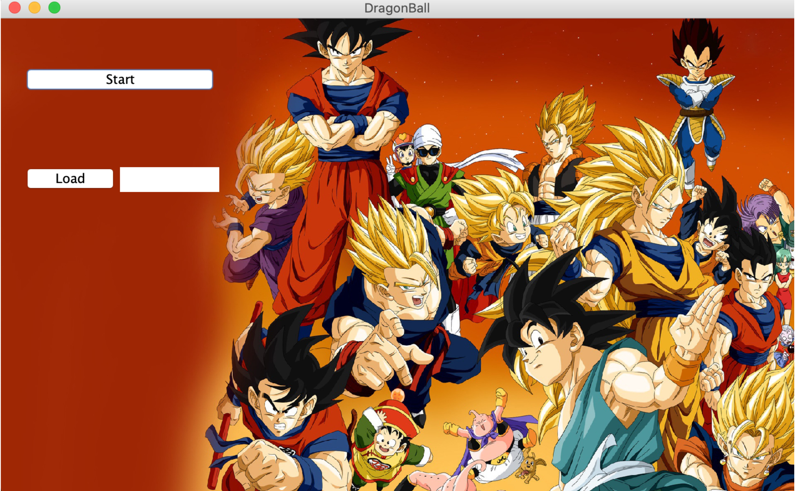
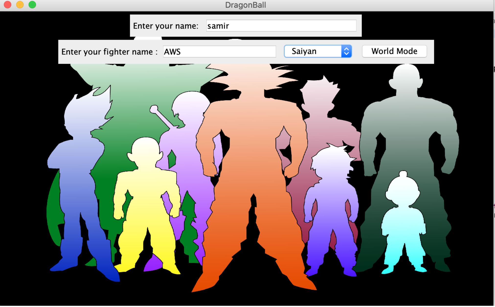
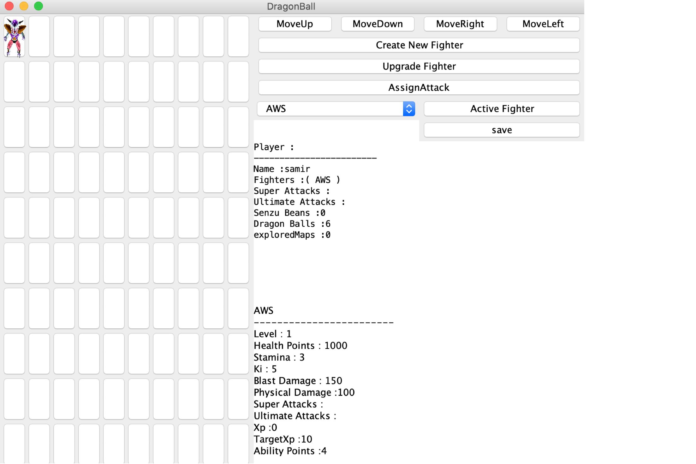
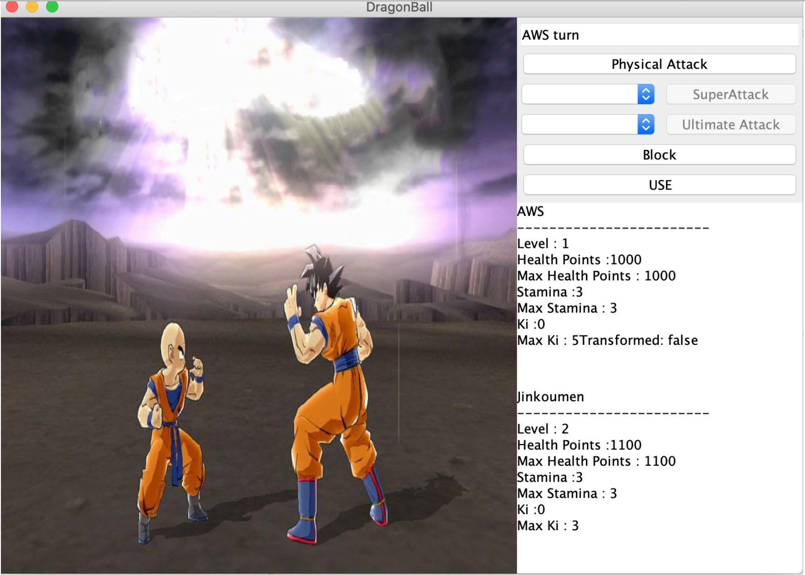
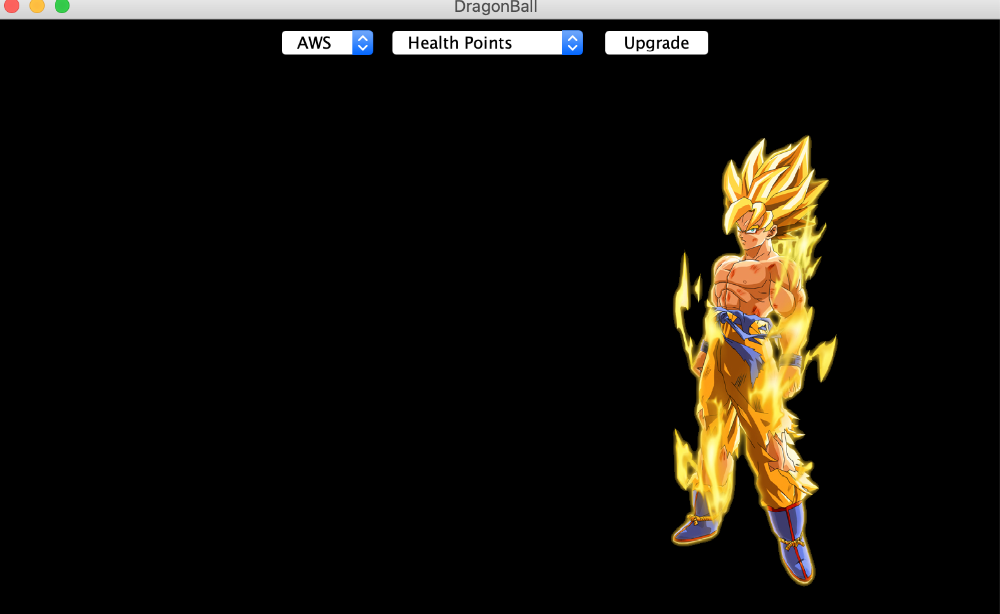

# Dragon-Ball-Adventures-Game
 
 # Project Overview

GUC, CSEN401

The purpose of this project was to learn the basics of object-oriented software development in Java, exception handling, and creating a GUI-based application. A role-playing game (RPG) based on Dragon Ball was developed. It consists of both a world exploration mode where the player navigates the a map as well as a battle mode. The possible actions and characteristics depend on the chosen type of fighter.
# Preview

# Project Partners
• Ahmed Eid 

• Sherif Ashraf
